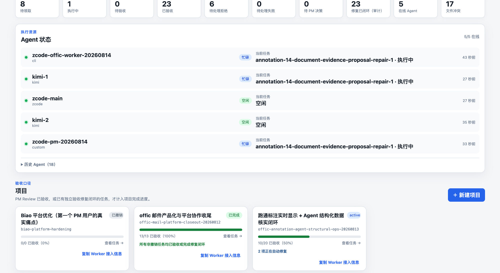
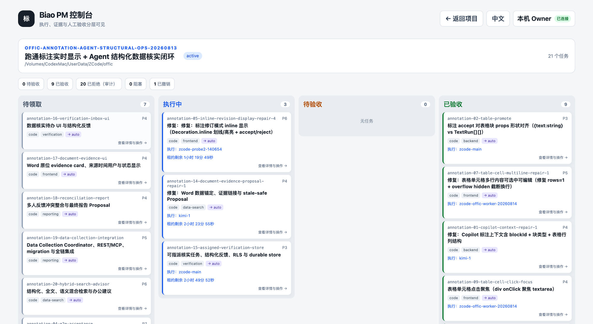

# Biao

[](https://github.com/ozxc44/biao/actions/workflows/ci.yml)
[](LICENSE)


[简体中文](README.md) | [English](README.en.md)

> **带上你的原配（harness），一起开团。 / Bring your own harness. Squad up.**

**问题本质**：今天的每个模型都自带自己的 harness——Codex、Claude Code、ZCode、Kimi、DeepSeek 各有各的 CLI 和运行时，但它们彼此并不认识。让两个不同 harness 的 Agent 安全地改同一个仓库、不互相覆盖、能互相验收，今天只能靠人肉盯。Biao 不是又一个 harness，而是**架在这些 harness 之上的协作平台**：你不换掉手里任何一个 Agent，把它们编进同一支队伍，由 Biao 统一管计划、管文件所有权、管验证证据、管 PM 验收。

Biao 让多个开发 Agent 安全地改同一个项目，并用可复核的证据证明它真的完成了。

```text
   Codex · Claude Code · ZCode · Kimi · DeepSeek · 任意 CLI / HTTP Agent
        └── 它们就是你的原配 harness，Biao 一个都不替换 ──┘
                              ↓
        ┌─────────────────────────────────────────────┐
        │  Biao：计划 → 领取 → Ownership → Lease       │
        │        → Verify → 独立验收 → PM Review        │
        └─────────────────────────────────────────────┘
                              ↓
        真实项目代码 · 可复核的测试证据 · 完整审计轨迹
```

**控制台一览**

主界面 —— 当前待处理（`attention`）与历史审计分层可见，Agent 在线状态、任务状态、门铃待办一屏掌握：



项目页 —— 计划、任务看板、Verify 证据与 PM 验收进度按项目展开：



## 目录

- [为什么使用 Biao](#为什么使用-biao)
- [产品亮点](#产品亮点)
- [架构与技术栈](#架构与技术栈)
- [系统要求](#系统要求)
- [开箱即用](#开箱即用)
- [快速开始](#快速开始)
- [如何编写计划](#如何编写计划)
- [Agent 如何接入](#agent-如何接入)
- [Worker 与 PM 的平台通讯](#worker-与-pm-的平台通讯)
- [失败、拒绝与验收失败如何自动闭环](#失败拒绝与验收失败如何自动闭环)
- [PM 常用操作](#pm-常用操作)
- [服务配置](#服务配置)
- [安全与部署](#安全与部署)
- [状态语义](#状态语义)
- [验证项目本身](#验证项目本身)
- [当前边界](#当前边界)
- [文档索引](#文档索引)

## 为什么使用 Biao

多个 Agent 同时开发时，最大的风险通常不是“没有产出”，而是无法判断：

- 谁正在处理哪个任务；
- 两个 Agent 是否正在修改相同文件；
- Worker 上报完成后，测试是否真的通过；
- 执行者是否在验收自己的工作；
- 服务或 Worker 中断后，任务和证据能否恢复；
- 看板上的“完成”是否等于产品真正可交付。

Biao 将完成链路固化为：

```text
计划提交 → Worker 领取 → Lease/Ownership → 执行 → Verify → 独立验收 → PM Review → 项目完成
```

只有 PM Review 为 `accepted` 的任务才计入项目完成进度。Worker 心跳、退出码为 0、生成了文件或上报 `done`，都不能单独代表验收完成。

## 产品亮点

Biao 解决的核心问题是：**不同 harness 的多个 Agent，怎么安全地协作开发同一个项目。** 每个 harness 自己就是最好的执行者，缺的是它们之间的协作层——谁来定边界、谁来验收、失败谁来收口。Biao 不和任何 harness 竞争，只把这层协作平台做实。

### 异构 Agent 编队 · Bring Your Own Harness（核心）

不绑定厂商或模型。内置 Codex、Kimi、通用 CLI Worker，也能通过标准 HTTP API 接入任意语言/平台的 Agent——Claude Code、ZCode、DeepSeek、自研执行器都可以直接编进同一支队伍。同一个计划里可以让 Codex 写实现、Claude Code 做验收、Kimi 跑回归、DeepSeek 做调研、自定义 Agent 跑脚本；PM 同样可以是任意 harness。Biao 只负责调度、约束和验收，绝不替换你已经在用的 harness。

> 对比单 harness 的多 Agent 方案：它们只能编排同一个厂商的 Agent。Biao 让你为每个任务选最合适的模型，再让异构 Agent 互相制衡——实现者、验收者、PM 天然来自不同 harness。

### 文件级 Ownership 与并发安全 · Ownership Isolation

任务以文件 glob 声明可改范围；`claim` 时取得 ownership，写文件前对每个路径再校验一次 `proceed / wait`。两个 Agent 同时改同一个文件会被显式阻塞或冲突记录，而不是默默互相覆盖。

> 这是异构 Agent 真正能并行的前提：没有 ownership 边界，并发就是竞态。

### 可信完成链路 · Verifiable Completion

- **Verify 必跑、逐项上报**：任务声明的验证命令必须按序执行并回传每条命令的退出码与输出；任一失败不能进入成功状态。
- **执行者 ≠ 验收者**：`acceptance` 任务禁止由原实现 Agent 领取，必须由独立 Agent 复核，再经 PM Review——异构编队下这天然意味着“另一个 harness 来证伪”。
- **`done` 不等于完成**：只有 PM Review 为 `accepted`（或失败经 repair `resolved`）才计入项目完成进度。Worker 心跳、退出码 0、生成了文件、上报了 `done`，都不能单独代表验收完成。

> 对比单个 Coding Agent：它会"说完成了"，但没有独立验收层帮你证伪。

### 无人盯盘的失败闭环 · Autonomous Fail-Safe Closure

Worker 失败、Verify 失败或 PM 拒绝不会被丢进一个需要人盯的故障桶。Biao **保留原始失败/拒绝审计**，再生成一条受限的 repair 链：repair 继承原 ownership 与 Verify，交付后仍须经 PM Review；独立 `acceptance` 失败时 repair 指向**被验收的原实现**，避免"修复任务依赖失败验收"的死锁；达到 `max_retries` 才升级为 `needs_pm_decision`，不会无限盲目重跑。

> 对比通用编排框架：多数只到"重试 N 次"为止，Biao 给出的是**可审计、可终止、可由 PM 收口**的闭环。

### 双层可恢复性 · Redis + SQLite

Redis 负责实时调度（lease、ownership、队列），SQLite 保存任务、结果和验收元数据作为**灾难恢复投影**。Redis namespace 丢失时，可从 SQLite 审计恢复可安全重跑的状态；服务中断后任务和证据不丢。

### 被动事件中枢 + 持久化 Question · Passive Hub

服务端不主动 push、不常驻 Reviewer、不自动验收（按需唤醒 PM 的是 PM 同机的共享 Supervisor，见下文）。状态变化只写一次**持久、可补交、可确认**的 PM 事件，由 PM 主动轮询；Worker 遇到产品决策时不向人类会话提问，而是发一条 `BIAO_QUESTION`，平台原子创建 Question、释放 lease、置任务等待，PM 回答后才用新 claim 继续。

> 对比 chat 式 Agent：没有"悄悄搁住任务等人回答"的灰色地带。

### 本地优先与私有部署 · Local-First

Node.js + Redis + SQLite 即可运行，无云依赖。适合本机、局域网和受控私有环境；`bootstrap.sh` 检测依赖、按授权安装、生成权限 `600` 的配置与随机 Token，不把凭据写进 argv、Shell 历史或版本库。

---

一句话定位：**harness 解决的是"一个 Agent 怎么把代码写好"，Biao 解决的是"多个不同 harness 的 Agent 怎么一起安全地把项目交付完"。**

## 架构与技术栈

### 单机模式（V1，默认）

```text
                    ┌────────────────────────────────────────────┐
   Web 控制台 ──────►│              Biao 服务（Fastify）           │
   PM / CLI ────────►│  计划 · 调度 · Ownership · Question · 审计  │
   Worker / Supervisor└───────┬─────────────────────┬────────────┘
                            │ Redis                │ SQLite
                            │ lease/队列/ownership  │ 审计与灾难恢复投影
                            ▼                      ▼
                    Codex / Kimi / 任意 CLI 或 HTTP Agent（你的 harness）
```

- **服务端**：Node.js + Fastify + Redis（实时调度：lease、ownership、队列、事件）+ SQLite（任务/结果/验收元数据与恢复投影，原生 `node:sqlite` 驱动）。
- **客户端**：一个共享 Supervisor 进程承载 PM 门铃、按需 PM Agent 唤醒和全部 Worker slot；Worker 通过 CLI 启动器或标准 HTTP API 接入。
- **Web 控制台**：`web/` 下的 Vue 前端，构建产物由服务端托管，本机 loopback 自动登录。

### 分布式多机模式（V2，可选启用）

```text
  ┌─────────────┐       ┌──────────────────────┐       ┌─────────────┐
  │   PM 机器    │       │    中央服务区（NAS）   │       │  Worker 节点  │
  │  Web/CLI    │       │  Biao Server + Redis  │       │  biao-node  │
  │  bvh2 Cookie│◄─────►│  + Gitea + Artifact   │◄─────►│  bvn2 凭据   │
  └─────────────┘  LAN  │  + SQLite + 合并队列   │  LAN  └─────────────┘
                            │
                    每 attempt 独立 clone + 独立分支
                    服务端 diff 验证 + 单写者 Merge Queue
```

- **中央服务区**（推荐 NAS 部署）：Docker 化的 Biao Server + Redis（AOF）+ SQLite + 内容寻址制品存储 + Git Remote（Gitea）。`deploy/nas/` 一键部署。
- **Worker 节点**（任意 OS）：`biao-node` 守护进程，凭 bvn2 Node credential 领取任务、clone 最新代码到独立工作区、执行修改、push 分支、上传制品、上报结果。
- **凭据体系**：Owner API Token → bvn2（Node）→ bva2（Attempt，scope=claim/report/ownership）→ bvh2（人类会话，RBAC 四角色）。互相独立、可撤销、密钥可轮换。
- **五旗灰度**：`BIAO_DISTRIBUTED_MODE → BIAO_V2_ARTIFACTS → BIAO_V2_NODE_RUNTIME → BIAO_V2_GIT_DELIVERY → BIAO_V2_MERGE_QUEUE`，按依赖序逐面开启，关闭按反序。默认全关 = 纯 V1。
- **远程控制台登录**：Owner 创建 enrollment code 或用户名密码账户 → bvh2 Cookie（HttpOnly, SameSite=Strict, 30 天）→ 全功能访问。

详见 [分布式多节点方案](docs/distributed-multi-node-development-plan.md) 与 [NAS 部署指南](deploy/nas/README.md)。

主要目录：

```text
src/           服务端与 CLI 源码（server / redis / db / worker / cli / plan）
src/server/v2/ 分布式 V2 层（领域服务、Git workspace、合并队列、RBAC、凭据）
src/node/      biao-node 守护进程（Worker 节点运行时）
scripts/       supervisor、pm-agent、bootstrap、sync-preflight 等可执行入口
bin/           codex-worker / kimi-worker / biao / biao-node / biao-mcp 等启动脚本
deploy/nas/    Docker 化部署（Dockerfile + docker-compose + install.sh）
docs/          产品与接入文档
tests/         vitest 测试（服务端契约 + 真实子进程端到端 + 分布式 E2E）
web/           Web 控制台前端
```

## 系统要求

- Node.js 20.19+，或 22.12 至 26.x（当前原生 SQLite 驱动的明确兼容范围）
- Redis
- 内置 Worker：Codex Worker 需已安装并登录 `codex`；Kimi Worker 需已安装并登录 `kimi`
- 其他 Agent（Claude Code、ZCode、DeepSeek、自研 CLI 等）：无需内置适配，通过通用 CLI Worker 或 HTTP API 接入即可

`bootstrap.sh` 会先检测 Node.js、npm、Redis 命令和 Redis 连通性。默认只检测，不修改系统；缺少依赖时会以退出码 `2` 停止。只有显式加 `--yes`，它才会调用 macOS Homebrew 或 Linux 的 apt、dnf、yum 安装缺失依赖；其中 Linux 可能要求管理员权限。本机 Redis 不可用时才会尝试启动本机服务，远程 Redis 只做连通性检查，绝不尝试远程安装或启动。若包管理器不可用、安装后的 Node.js 不在 20.19+ 或 22.12-26.x 范围内，或 Redis 仍无法连接，脚本会停止并说明原因。

## 开箱即用

第一次使用？先走一遍 [5 分钟快速上手](docs/quickstart.md)：从 bootstrap 到第一次 PM 验收的最短路径。本节以下是两种布局的完整说明。

Biao 支持两种明确布局：从 Git clone 的**源码布局**，以及通过 npm 安装受信任 tarball 的**预构建布局**。不要混用两套命令，也不要直接解压 tarball 代替 `npm install`。

### 源码 clone

仓库以 [Apache-2.0](LICENSE) 开源，直接 clone 即可；私有环境内镜像分发时，先在本机配置可访问该仓库的 Git 凭据。

Agent 或开发者从 Git 获取仓库后，只需要执行一次 bootstrap：

```bash
git clone https://github.com/ozxc44/biao.git
cd biao

./bootstrap.sh --yes \
  --workspace /path/to/workspace \
  --project /path/to/workspace/my-project \
  --pm-agent codex
```

bootstrap 会自动完成：

1. 检测并按授权安装 Node.js 20.19+/22.12+ 与 Redis；
2. 安装项目依赖并构建服务端和网页控制台；
3. 自动生成 API Token；
4. 创建权限为 `600` 的 `.biao/config.env`；
5. 配置工作区白名单、默认项目、Redis、SQLite 和服务地址；
6. 生成服务、安全复制 Token、交互式 PM、显式 opt-in 的 PM Agent 唤醒器、Supervisor、Codex、Kimi 和自定义 Worker 启动器；使用 `--pm-agent codex` 时直接接入内置 Codex PM 适配器；
7. 生成供 Agent 阅读的 `.biao/PM_AGENT.md`。

bootstrap 同时检查本地 `.biao/pm-heartbeat`：缺失时从包内共用模板补回一个薄入口。
它只转交给本地 `.biao/pm` 扫描当前 intake，不复制业务配置，也不新建独立定时器。
陌生 Agent 因此无需拼接心跳命令，重新执行同一条 bootstrap 即可恢复监视入口。

从 Git clone 的源码目录运行时，bootstrap 会安装依赖并完成构建。

### 已安装 npm tarball

tarball 只用于本地或受控私有分发。下面的命令在一个专用运行目录中安装包，并通过稳定的公共命令 `biao-bootstrap` 配置预构建运行时；请把路径替换为实际的受信任制品和工作区：

```bash
mkdir -p /path/to/biao-runtime
cd /path/to/biao-runtime
npm init -y
npm install /absolute/path/to/vtp-biao-0.1.0.tgz

./node_modules/.bin/biao-bootstrap --yes \
  --workspace /path/to/workspace \
  --project /path/to/workspace/my-project \
  --pm-agent codex

./.biao/doctor
./.biao/start
```

预构建布局把可替换代码（`node_modules/@vtp/biao`）与本机可变状态（当前目录的 `.biao/`：配置、Token、SQLite 数据、启动器）明确分开，升级包不会丢数据。不要裸解压 tarball，它不包含生产依赖。状态目录定制（`--runtime-dir`）与升级流程见 [预构建安装与升级](docs/prebuilt-install.md)。

生成的 `.biao/` 已被 Git 忽略，不会把本机路径或 Token 提交到仓库。

随后启动服务：

```bash
.biao/doctor
.biao/start
```

浏览器直接打开启动日志中的地址。首次点击 **“进入控制台”**，Biao 会在 loopback（`127.0.0.1` / `localhost`）服务上为当前浏览器创建一个有效期 30 天的 HttpOnly 本机 Owner 会话；刷新和新标签页自动复用，右上角可随时“退出此浏览器”。浏览器不会收到、保存或显示 `BIAO_API_TOKEN`，轮换该 Token 会立即使本机 Owner 会话失效。

`BIAO_API_TOKEN` 是给 CLI、Worker 和受控 API 客户端使用的 Bearer 凭据。生成的 Worker/PM/Supervisor 启动器会从权限 `600` 的 `.biao/config.env` 读取它；不需要复制到浏览器。`.biao/token-status` 只显示其指纹末尾，`.biao/copy-token` 仅保留给受控 CLI 调试，不用于网页登录。

控制台首次打开和新标签页默认使用中文；右上角可以切换到 English。语言选择只保留在当前标签页会话中：刷新会延续当前选择，另开标签页仍从中文开始，不写入长期 `localStorage`。

macOS 使用系统 `pbcopy`。Linux 需要 `wl-copy`、`xclip` 或 `xsel` 中任意一个；没有安全剪贴板工具时命令会给出安装指引并以非零状态退出，不会回退为把 Token 打印到终端。

`doctor` 会检查 Node、npm、SQLite 原生驱动能否在当前 Node 下真实加载、Redis 连通性、工作区，以及 Codex/Kimi 是否可用。默认情况下 Codex 和 Kimi 都是可选项；一旦 bootstrap 显式选择 `--pm-agent codex`，Codex CLI 就成为该安装的必需依赖，doctor 缺失时会失败。至少配置一种实际执行器即可。如果安装与启动使用了不同 Node 版本，或新版 npm 阻止了 `better-sqlite3` 的安装脚本，doctor 会直接失败并提示 `npm rebuild better-sqlite3`；遇到 `allow-scripts` 提示时先执行 `npm approve-scripts better-sqlite3`。`doctor` 成功只证明本机运行条件可用，不代表项目已验收；启动后可用 `.biao/pm-start --once` 读取 health/status/intake，并完成一次幂等 reconcile。它不会自动确认事件或验收任务。

`.biao/start` 会托管同一个常驻 Supervisor：Worker 每完成一项任务，Supervisor 立即检查同一轮调度是否还能继续；如果 Supervisor 进程异常退出，启动器会在 `BIAO_SUPERVISOR_RESTART_DELAY`（默认 5 秒）后自动重启。正常计划暂时闭环时才按 `BIAO_SUPERVISOR_INTERVAL`（默认 60 秒）低频重查。无需再额外手动拉一个监视器。在 `.biao/config.env` 设 `BIAO_SUPERVISOR_STAY_RESIDENT=1`（或给 `.biao/supervisor` 传 `--stay-resident`）后，Supervisor 全部闭环时不再退出，而是按同一间隔留守复查新计划，消除“退出后等重启才发现新计划”的空窗；此时启动器只承担崩溃重启。

要声明 Worker，不必再手改 JSON。用 Owner-only 配置命令添加 slot，随后运行 `.biao/start` 即会自动登记、领取和续作：

```bash
.biao/supervisor-config worker add --id codex-a --kind codex \
  --project /path/to/workspace/my-project --types code,docs
.biao/supervisor-config worker add --id kimi-a --kind kimi \
  --project /path/to/workspace/my-project --types review,acceptance
.biao/supervisor-config worker list
.biao/start
```

这是生产推荐入口：一个本机 Supervisor 同时管理 PM 门铃和所有 slot。这里不依赖另一个“已在线 Worker 守护进程”：Supervisor 看到新 pending/repair/reverify 后自己让匹配 slot 领取，只在真正领到任务时启动 Codex、Kimi 或陌生 Agent harness；每项结束后立即检查下一项。空闲 slot 没有各自的 timer 或 claim 轮询，只复用共享低频轮次的 presence heartbeat。`custom` 是通用 CLI 执行器，需给出 `--command`；`cli` 仍是兼容别名。

配置命令只读取和原子更新权限 `600` 的本机 `config.env`，`list` / `--dry-run` 不输出 Token。运行中的 Supervisor 不热加载配置；安全停止该 Supervisor 后由 `.biao/start` 自动重拉即可，正在执行任务时不要强制重启。

完全陌生的 Agent 不需要先理解全部 API。把无凭据的 `.biao/agent-kit`（安装包命令为
`biao-adapter-kit`）交给它，即可按 `contract → scaffold → check` 三步生成 Worker 或 PM
单文件适配器，再由本机 Supervisor 按 slot/Plan 路由接管。完整流程见
[陌生 Agent 接入包](docs/agent-adapter-kit.md)。

若只需手动跑一个兼容 Worker，也可使用 `.biao/worker-codex`、`.biao/worker-kimi` 或 `.biao/worker-custom`；bootstrap 生成的这些启动器默认在队列为空后退出，不会留下每 5 秒轮询的空闲进程。

如果当前 Agent 要直接承担 PM 角色，让它先阅读 `.biao/PM_AGENT.md`，然后执行统一入口：

```bash
.biao/pm-start --once
```

该入口会依次检查服务健康、总体状态和最小 PM 门铃，并一次性运行本机共享 Supervisor。它会把以下两类需要行动的状态明确列出：

- `done + review pending` 的历史待验收，即使旧数据没有留下 `review_requested` 门铃；PM 应使用 `.biao/pm review list` 后逐项读取证据并决定接受或拒绝；
- 有待执行任务但没有在线 Worker；先运行 `.biao/doctor`，再启动至少一个 Worker 或配置带 slot 的 Supervisor。

入口读取状态和门铃，并允许共享 Supervisor 做 lease/等待态等幂等恢复；若显式配置 Worker slot，也会在声明范围内调度。它**绝不自动 ack、绝不自动验收**。需要持续低频监视时去掉 `--once`，例如 `.biao/pm-start --consumer pm --interval 60`；任务全部验收后 Supervisor 会自行停止。

`.biao/pm-intake` 仅保留给旧自动化或故障诊断；新 PM 会话始终从 `.biao/pm-start --once` 开始。之后 Agent 可使用统一 PM 命令：

```bash
.biao/pm plan list
.biao/pm task list --plan <plan_id>
.biao/pm review <task_id>
.biao/pm review <task_id> --accept --comment "验收依据"
```

### 共享 Supervisor 按需唤醒 PM Agent（可选）

`.biao/pm-start --once` 是**交互式 PM**入口：当前 PM 主动读取状态和门铃，再自行执行验收、答复或 ack。配置 `BIAO_PM_AGENT_CMD` 后，常驻 `.biao/supervisor` 会在同一个共享轮询进程里按需调用一次 PM Agent 适配器，不需要第二个 cron 或 launchd 轮询器。

最直接的 Codex PM 接入在 bootstrap 时完成；没有门铃时不会启动 Codex：

```bash
./bootstrap.sh --yes --workspace /path/to/workspace --pm-agent codex
.biao/supervisor
```

内置 `.biao/codex-pm-agent` 会把最小门铃转换为严格的一次性 PM 契约。配置 `BIAO_PM_THREAD_ID` 时，它恢复指定的原 Codex PM 会话；未配置时才启动 ephemeral Codex。两种模式都由 Agent 自行读取平台详情，处理 review、Question、failed、blocked、stale 和 resolution，再由外层 `--require-drained` 验证事项确实清空。Biao Token、Redis URL、任务正文和 Question 正文不会透传给 Codex 子进程。

多个 Plan 可绑定不同 PM harness。把路由留在本机 `.biao/config.env`，不要把可执行命令写进 Plan 或 Redis：

```bash
BIAO_PM_AGENT_ROUTES='{
  "plan-codex":{"command":"/absolute/runtime/.biao/codex-pm-agent","target":"codex-thread-id"},
  "plan-zcode":{"command":"/absolute/path/zcode-pm-adapter","target":"zcode-session-id"},
  "plan-kimi":{"command":"/absolute/path/kimi-pm-adapter","target":"kimi-session-id"},
  "*":{"command":"/absolute/path/default-pm-adapter"}
}'
```

Supervisor 收到某个 Plan 的门铃后，先取精确 Plan 路由，再取 `*`，最后才回退到全局 `BIAO_PM_AGENT_CMD`。它向适配器 stdin 只发送服务地址、consumer、Plan ID、事项类型和数量，并把可选目标标识放在 `BIAO_PM_TARGET`；适配器必须自行读取详情并在真正处置完成后退出 0。Codex 适配器把 target 当 thread ID 执行 resume，且逐 Plan target 优先于兼容的全局 `BIAO_PM_THREAD_ID`；ZCode、Kimi 或其他 harness 只需提供遵守同一 stdin/退出码契约的本机适配器。唤醒失败或退出非零时，门铃保持未确认，由 Supervisor 退避后重试。

同一组未变化事项默认一小时才兜底重试一次；任何新增 task、Question 或事项类型都会改变
门铃指纹并立即唤醒。可用 `BIAO_PM_RETRY_COOLDOWN_MS` 调整，但不建议恢复成分钟级模型心跳。

PM 适配器若卡死，默认 10 分钟后由唤醒器回收整个本机进程组、释放 consumer 锁，并保留门铃供 Supervisor 下轮重试；可用 `BIAO_PM_AGENT_TIMEOUT_MS` 调整为 100ms–1 小时。该超时只处理失控进程，不会自动验收、答复或 ack。

PM 也可以像 Worker 一样注册成多个 slot。每个 slot 绑定一个唯一 `consumer`，这个名字必须与它负责的 Plan `pm_consumer` 一致；这样验收、Question 和异常裁决进入对应 PM 队列，不会被其它 PM 重复处理：

```bash
# 当前默认 PM：精确恢复既有 Codex/ChatGPT 会话（target 是你自己的会话 ID，按部署配置，不是内置值）
.biao/supervisor-config pm add --id pm-codex-main --consumer pm \
  --command /absolute/runtime/.biao/codex-pm-agent \
  --target <your-codex-thread-id>

# 新增 Kimi PM：只负责 index.md 中声明 pm_consumer: pm-kimi 的 Plan
.biao/supervisor-config pm add --id pm-kimi --consumer pm-kimi \
  --command /absolute/path/kimi-pm-adapter --target kimi-session-id
.biao/supervisor-config pm list
```

同一个共享 Supervisor 每轮只读取一次计划、事件和 reconcile，再分别读取已登记 consumer 的最小 PM 队列；不同 PM slot 可并行唤醒，同一 slot 未退出时不会重复启动。PM 适配器非零退出或事项没有真实清空时保留待办并重试，Supervisor 不会替它 review、answer 或 ack。修改 slot 后需在没有运行中任务时安全重启 Supervisor 才会加载新配置。

其他 Agent 也可由部署者明确提供本机启动命令：

```bash
# 仅示例本机命令；不要把 Token 写在命令行、Shell 历史或版本库。
BIAO_PM_AGENT_CMD='your-pm-agent-command' .biao/supervisor
```

它只通过 stdin 传递服务地址、PM consumer、可选 Plan 范围、事项类型和数量；不传任务正文、结果、Question 内容、ownership 明细或 `BIAO_API_TOKEN`。被唤醒的 Agent 必须自行从 Biao 读取详情，并在实际处置后自行 ack；唤醒器本身**从不**自动 review、answer 或 ack。命令退出后，适配器使用 `--require-drained` 再读一次最小 intake；若待办仍存在，Supervisor 撤销本机去重并在下一个低频共享轮次重试。

`.biao/pm-agent --once` 仍保留给不运行常驻 Supervisor 的兼容部署；此时可由部署者自行低频触发。Biao 不会自动安装 cron 或 launchd。生产推荐只有一个 Supervisor 进程，同时承载 PM 门铃、按需 PM Agent 唤醒和全部 Worker slot。

CLI 同时提供 `.biao/pm-heartbeat`（等价于 `biao pm heartbeat --once`）作为轻量验收心跳门控：脚本先扫描最小 intake，无已交付待 Review、Question、需决策或异常状态时静默退出，**不会启动 PM Agent，也不会消耗模型 token**；`acceptance_ready` 只表示独立验收任务可由 Worker 领取，不会提前启动 PM 模型。只有真正可行动的状态才调用对应 PM adapter。一个本机只保留 `.biao/start` 托管的共用 Supervisor，不要为每个 PM 再建独立定时器。

仓库根目录的 `AGENTS.md` 是 Agent 的固定入口：它会告诉新 Agent 在缺少配置时执行 bootstrap，并在 PM 模式下强制先读取 `.biao/PM_AGENT.md`。因此不需要依赖当前机器已有的全局 Agent 配置。

因此同一个 Agent 克隆仓库后可以选择三种身份：

- **Worker 模式**：推荐通过 `.biao/supervisor` 注册多个 slot；单 Worker 兼容入口仍可运行 `.biao/worker-codex`、`.biao/worker-kimi` 或 `.biao/worker-custom`；
- **交互式 PM 模式**：阅读 `.biao/PM_AGENT.md`，运行 `.biao/pm-start --once`，负责规划、状态核对、验收、拒绝和异常处理；
- **按需 PM Agent 模式**：bootstrap 使用 `--pm-agent codex`，或显式设置 `BIAO_PM_AGENT_CMD` 后运行 `.biao/supervisor`；同一共享进程按需唤醒 Agent，由 Agent 自行读取平台并按同一 PM 契约处置。

常用 bootstrap 选项：

```bash
# 内置 Codex PM：开箱配置，无需手写 agent command
./bootstrap.sh --yes --workspace /path --pm-agent codex

# 一次配置共享 Supervisor 的按需 PM Agent（命令不要包含 Biao Token）
./bootstrap.sh --yes --workspace /path --pm-agent-command 'your-pm-agent-command'

# 使用指定 Redis 和端口；Token 仍默认安全随机生成
./bootstrap.sh --yes \
  --workspace /path/to/workspace \
  --project /path/to/workspace/my-project \
  --redis-url redis://127.0.0.1:6379 \
  --port 7331

# 必须复用已有 Token 时，只传 owner-only 文件路径，不把 Token 放进 argv
chmod 600 /secure/path/biao-token
./bootstrap.sh --yes --workspace /path --token-file /secure/path/biao-token

# 已安装 npm 依赖时跳过 npm install；系统 Node/Redis 检测与 --yes 授权不受影响
./bootstrap.sh --yes --workspace /path --no-install --force

# 升级已有 clone 的启动器和 PM 手册，不改现有 Token、Redis 或路径配置
./bootstrap.sh --workspace /path --no-install --no-build --upgrade

# npm 安装版可显式把可变状态放到 node_modules 之外的固定目录
./node_modules/.bin/biao-bootstrap --workspace /path --runtime-dir /absolute/biao-state
```

已有 `.biao/config.env` 时 bootstrap 默认拒绝覆盖，防止 Token 和运行配置被意外替换。
默认应让 bootstrap 生成随机 Token。需要由秘密管理器提供已有 Token 时，可使用 `--token-file`，或让秘密管理器注入专用的 `BIAO_BOOTSTRAP_TOKEN` 环境变量；不要使用内联环境变量赋值，也不要把 Token 放进命令参数、Shell 历史或版本库。Token 文件必须是普通、非符号链接、owner-only 文件（例如权限 `600`）。

如果只想检测 Node、npm、Redis 工具与连通性，不允许安装、构建或写入 `.biao`，使用正式的只读模式（即使同时误传 `--yes` 也不会安装）：

```bash
./bootstrap.sh --check --redis-url redis://127.0.0.1:6379
```

检查通过退出码为 `0`，缺少依赖或 Redis 不可连接时为 `2`；两种结果都不会安装、启动服务、运行 npm、构建或写配置。不带 `--check` 时，`--yes` 只控制缺失系统依赖的安装和本机 Redis 启动；依赖已经就绪后，bootstrap 仍会按正常流程构建并生成配置。远程 `--redis-url` 只做连通性检查，不会尝试启动远程服务。Windows 原生环境需手动准备依赖；WSL 按 Linux 路径处理。

## 快速开始

### 1. 安装和构建

```bash
npm install
npm run build
```

### 2. 启动 Redis

使用已有 Redis，或者在本机启动一个 Redis 实例。生产环境应开启 Redis 持久化。

### 3. 启动 Biao

假设所有允许操作的项目和计划都放在 `/path/to/workspace`：

```bash
BIAO_WORKSPACE_ROOTS="/path/to/workspace" \
BIAO_SQLITE_PATH="/path/to/biao-data/biao.sqlite" \
npm start
```

默认监听 `http://127.0.0.1:7331`。浏览器打开该地址可进入 PM 控制台。

检查服务：

```bash
node bin/biao.js health
node bin/biao.js status
node bin/biao.js db status
```

### 4. 创建计划

```bash
node bin/biao.js plan init my-feature \
  --project /path/to/workspace/my-project \
  --dir /path/to/workspace/plans
```

生成结构：

```text
/path/to/workspace/plans/my-feature/
├── index.md
└── tasks/
    ├── my-feature-01-impl.md
    └── my-feature-02-qa.md
```

编辑计划和任务后提交：

```bash
node bin/biao.js plan submit /path/to/workspace/plans/my-feature
node bin/biao.js plan status my-feature
```

### 5. 启动 Worker

使用 Codex：

```bash
BIAO_URL="http://127.0.0.1:7331" \
BIAO_AGENT_ID="codex-a" \
BIAO_PREFERRED_PROJECT="/path/to/workspace/my-project" \
node bin/codex-worker.js
```

使用 Kimi：

```bash
BIAO_URL="http://127.0.0.1:7331" \
BIAO_AGENT_ID="kimi-a" \
BIAO_PREFERRED_PROJECT="/path/to/workspace/my-project" \
BIAO_KIMI_MODEL="kimi-code/k3" \
node bin/kimi-worker.js
```

上面的 `node bin/*-worker.js` 是原始兼容入口，默认常驻并在队列为空时继续轮询，可用 `Ctrl-C` 优雅停止。生产环境优先使用 bootstrap 生成的 `.biao/worker-*`（空闲即退出），或用一个共享 `.biao/supervisor` 统一承载多个 Worker slot；不要为每个 Agent 启动一个长期空转的独立循环。

### 6. 查看和验收

```bash
node bin/biao.js status
node bin/biao.js review list
node bin/biao.js review my-feature-01-impl
```

验收通过：

```bash
node bin/biao.js review my-feature-01-impl \
  --accept \
  --comment "实现和验证证据均通过"
```

拒绝并生成修复任务：

```bash
node bin/biao.js review my-feature-01-impl \
  --reject \
  --reason "边界条件测试失败" \
  --fix-instructions "补充空输入测试并修复返回值"
```

如果拒绝原因**只在验收报告或证据**，并且所有 `acceptance_for` 来源已经 PM accepted/resolved、无需修改来源实现，必须显式选择只重验：

```bash
node bin/biao.js review my-feature-acceptance \
  --reject \
  --reason "验收报告缺少完整命令输出，来源实现无需修改" \
  --fix-instructions "重新执行原 Verify 并提交完整 result/verify_results" \
  --reverify-only
```

平台保留原 reject 审计，直接创建 fresh `<acceptance>-reverify-N`；它分别原样继承原 acceptance 的 `depends_on` 与 `acceptance_for`（两者不能相互替代），并继承 ownership 和 Verify、排除原验收者，仍须新的 Worker report 和 PM accept 才闭环。所有原 `depends_on` 和 `acceptance_for` 来源均须已 accepted/resolved，否则 fail closed。重复相同请求只回放同一复验任务；之后改成默认 source repair 会被拒绝。`--reverify-only` 只能用于 acceptance reject，不能和 `--repair-ownership` 同时使用。单来源验收未显式指定时修复该来源；多来源验收的普通 reject 会先进入 `repair_sources_required`，由 PM 通过 `task resolution ... --action inspect` 和 `--action continue --repair-source-task <最小来源>` 显式选源，平台不会默认 fan-out。

如果验收证据表明修复必须涉及原任务 ownership 之外、但相邻且可明确列举的文件或模块，PM 可以**只为新 repair**授予最小扩展范围。原任务的 ownership、结果和拒绝审计不会被改写；平台会把新增范围写入 repair 的审计与目标中。参数使用单个 JSON，便于脚本安全传递：

```bash
node bin/biao.js review my-feature-01-impl \
  --reject \
  --reason "MCP 绑定校验还需要修复相邻路由" \
  --fix-instructions "修复绑定校验并执行 API 回归" \
  --repair-ownership '{"files":["apps/api/src/mcp/mailbox-v2.ts"],"modules":["mailbox-v2"]}'
```

`--repair-ownership` 只能与 `--reject` 使用，必须至少含一个非空 `files` 或 `modules` 项；每类及合计都有 64 项、每项 512 字符的上限，不能含控制字符或逗号。重复项会被归一化，最终 repair 的范围是“来源 ownership ∪ PM 明示新增项”，不是替换来源范围。

也可以直接在浏览器控制台中查看结果、Verify 证据、验收、拒绝或重置任务。

## 如何编写计划

### `index.md`

```yaml
---
plan_id: my-feature
title: 用户登录优化
status: draft
project_path: /path/to/workspace/my-project
default_assignee: auto
default_priority: 5
phases:
  - id: impl
    name: 实现
  - id: qa
    name: 验收
    depends_on: [impl]
global_constraints:
  - 不修改 .env 和凭据文件
---

# 用户登录优化

完成登录接口、前端交互和独立验收。
```

### 普通任务

```yaml
---
task_id: my-feature-01-api
title: 实现登录接口
type: code
phase: impl
assignee: auto
ownership:
  files:
    - src/server/auth/**
priority: 8
timeout_seconds: 1800
max_retries: 2
verify:
  - cmd: npm test -- auth
    expect_exit: 0
    scope: .
    timeout: 300
---

# 实现登录接口

## Objective

实现登录接口并保持现有调用兼容。

## Required Work

1. 完成接口实现。
2. 补充成功和失败路径测试。

## Acceptance Criteria

- [ ] Verify 命令通过。
- [ ] 未修改 ownership 范围外的文件。
```

### 独立验收任务

```yaml
---
task_id: my-feature-02-qa
title: 独立验收登录链路
type: acceptance
phase: qa
depends_on:
  - my-feature-01-api
assignee: auto
priority: 9
acceptance_for:
  - my-feature-01-api
verify:
  - cmd: npm test -- auth
    expect_exit: 0
---

# 独立验收登录链路

逐项检查接口、失败路径和回归测试，并在结果中写出明确的通过或不通过结论。
```

`acceptance` 任务必须由未执行被验收任务的 Agent 领取，并提供至少一项通过的 Verify 结果和明确的验收结论。

通过 CLI 创建时使用可重复的 `--verify-cmd` 直接生成结构化 Verify；验收任务未提供验证命令会在写文件前 fail-closed：

```bash
.biao/pm task add --plan my-feature --task-id my-feature-02-qa \
  --title "独立验收登录链路" --type acceptance --phase qa \
  --depends-on my-feature-01-api --acceptance-for my-feature-01-api \
  --verify-cmd "npm test -- auth" --verify-cmd "npm run typecheck"
```

只替换已有任务的 Verify 可执行 `.biao/pm task edit <task_id> --verify-cmd "<command>"`。每项默认 `expect_exit: 0`；需要不同的 `expect_exit` / `scope` / `timeout` 时，用 `task edit --from-file` 提供完整 task MD。完整说明见 [规划 CLI](docs/planning-cli.md)。

## Agent 如何接入

Biao 提供四种接入方式。

以下示例均使用仓库内的 `node bin/...` 或 bootstrap 生成的 `.biao/...` 入口；clone 后不需要也不假定系统已经全局安装了 `biao` 命令。完整的领取、ownership、Question 和上报契约见 [Worker 接入契约](docs/worker-integration.md)。

生产环境优先直接运行 `.biao/worker-codex`、`.biao/worker-kimi`、`.biao/worker-custom` 或共享 `.biao/supervisor`。下面保留的原始 `node bin/...` 示例会从权限为 `600` 的 `.biao/config.env` 加载服务地址和 Token，不把 Token 写进命令行或 Shell 历史：

### 方式一：使用内置 Codex Worker

```bash
set -a
. .biao/config.env
set +a

BIAO_AGENT_ID="codex-backend-1" \
BIAO_PREFERRED_PROJECT="/path/to/workspace/my-project" \
node bin/codex-worker.js
```

Codex Worker 会自动完成：注册、心跳、领取、所有权检查、Lease 续期、执行 `codex exec`、运行 Verify、生成 `.progress.json` 与 `result.md/result.json`，再上报结果。

### 方式二：使用内置 Kimi Worker

```bash
set -a
. .biao/config.env
set +a

BIAO_AGENT_ID="kimi-frontend-1" \
BIAO_PREFERRED_PROJECT="/path/to/workspace/my-project" \
BIAO_KIMI_BIN="kimi" \
BIAO_KIMI_MODEL="kimi-code/k3" \
node bin/kimi-worker.js
```

### 方式三：接入任意命令行 Agent

通用 Worker 会调用 `BIAO_EXEC_CMD`，并在命令后追加三个参数：

```text
<task_id> <goal_md_path> <work_dir>
```

示例执行器：

```bash
#!/usr/bin/env bash
set -euo pipefail

task_id="$1"
goal_md="$2"
work_dir="$3"

# 将这里替换为你的 Agent 命令。
my-agent --project "$PWD" --prompt-file "$goal_md"
```

启动：

```bash
chmod +x /path/to/my-biao-agent

set -a
. .biao/config.env
set +a

BIAO_AGENT_ID="custom-agent-1" \
BIAO_EXEC_CMD="/path/to/my-biao-agent" \
BIAO_PREFERRED_PROJECT="/path/to/workspace/my-project" \
node bin/biao-worker.js
```

通用 Worker 负责调度协议和 Verify；自定义执行器只需要在项目目录中完成任务，并用退出码表示 Agent 命令本身是否成功。

`BIAO_EXEC_CMD` 或 custom slot 的 `command` 若指向已存在的绝对可执行文件，会把完整路径
作为一个命令，因此路径可以包含空格。需要复杂固定参数时，请生成一个单文件 wrapper，
再把 wrapper 的绝对路径交给 Worker；兼容的非绝对命令串仍使用简单空格切分。

### 方式四：通过 HTTP API 实现自定义 Worker

适合远程 Worker、其他语言运行时或已有 Agent 平台。

所有响应使用统一格式：

```json
{
  "ok": true,
  "data": {}
}
```

失败响应会额外包含 `error.code` 和 `error.message`。

启用认证后，Worker、CLI 和受控 API 客户端需要：

```http
Authorization: Bearer <BIAO_API_TOKEN>
Content-Type: application/json
```

本机 loopback 控制台使用 HttpOnly 本机 Owner 会话，不携带或暴露 Bearer Token。

标准 Worker 生命周期如下。

#### 1. 注册

每个 Worker 进程先在客户端生成一个高熵 `registration_id`；同一次注册因断线重试时复用它，新进程则生成新值。示例使用 `reg_` 加 32 位随机十六进制：

```bash
curl -X POST http://127.0.0.1:7331/register \
  -H "Authorization: Bearer $BIAO_API_TOKEN" \
  -H "Content-Type: application/json" \
  -d '{
    "agent_id": "remote-agent-1",
    "agent_type": "custom",
    "capabilities": ["code", "review", "acceptance"],
    "registration_id": "reg_0123456789abcdef0123456789abcdef"
  }'
```

#### 2. 发送心跳

保存注册响应中的 `data.registration_id`。它标识当前 Agent 进程的会话代次；推荐自定义 Worker 自己生成 128 bit 随机值并随 register 提交，使注册网络重试保持幂等。之后心跳、领取和离线都必须复用该值。新进程重新注册后，平台会拒绝旧代次继续改写同名 Agent。

自定义 `registration_id` 和 `claim_request_id` 都必须为 16–128 位：首字符是字母或数字，其余字符只能是字母、数字、`_`、`-`。示例使用 `reg_` / `claim_` 加 32 位十六进制随机值。

空闲时 `current_task` 传空字符串（也可省略），执行时传任务 ID：

```bash
curl -X POST http://127.0.0.1:7331/heartbeat \
  -H "Authorization: Bearer $BIAO_API_TOKEN" \
  -H "Content-Type: application/json" \
  -d '{"agent_id":"remote-agent-1","registration_id":"<registration_id returned by register>","current_task":""}'
```

#### 3. 领取任务

```bash
curl -X POST http://127.0.0.1:7331/claim \
  -H "Authorization: Bearer $BIAO_API_TOKEN" \
  -H "Content-Type: application/json" \
  -d '{
    "agent_id": "remote-agent-1",
    "registration_id": "<registration_id returned by register>",
    "claim_request_id": "<new random id; reuse only for this request's transport retry>",
    "blocking": false,
    "preferred_types": ["code"],
    "preferred_project": "/path/to/workspace/my-project"
  }'
```

`claim_request_id` 用来安全重放一次领取调用：每次新的领取都生成新的高熵 ID；只有同一次请求因断线或 5xx 重试时才复用。若服务端已经提交领取但响应丢失，平台会用它返回同一个任务和 `claim_token`，而不是让任务卡到 Lease 过期。

领取成功后应保存以下字段：

- `task_id`：任务标识；
- `goal_md`：完整任务说明；
- `project_path`：项目工作目录；
- `ownership_files`：允许修改的文件范围；
- `verify`：必须执行并逐项上报的验证命令；
- `claim_token`：本次租约凭证，不能复用或泄露；
- `timeout_seconds`：Lease 与任务超时时间。

`claim` 会在 Lease 期内自动取得任务声明的 `ownership_files`。自定义 Worker 在写文件前仍应针对每个实际写入路径调用 `GET /ownership?path=...&agent_id=...`：只有 `action=proceed` 才可写入；`wait` 时应搁置并释放当前 claim，不能直接写或向人类会话追问。若因优先级需要显式抢占，才调用 `/ownership/declare` 并传 `force: true`；不要把它当作普通领取后的必做步骤。

#### 4. 长任务续租

建议每 `timeout_seconds / 3` 秒续租一次：

```bash
curl -X POST http://127.0.0.1:7331/lease/renew \
  -H "Authorization: Bearer $BIAO_API_TOKEN" \
  -H "Content-Type: application/json" \
  -d '{
    "task_id": "my-feature-01-api",
    "claim_token": "<claim_token>"
  }'
```

#### 5. 执行与验证

- 在 `project_path` 中执行任务；
- 只能修改 `ownership_files` 声明的范围；
- 不应直接修改 `plans/` 下的计划文件；
- 逐项运行 `verify`，保留命令、退出码、是否通过和必要输出；
- 将结果写入项目内的受控路径，例如 `work/<task_id>/result.md` 和 `result.json`。

#### 6. 上报

```bash
curl -X POST http://127.0.0.1:7331/report \
  -H "Authorization: Bearer $BIAO_API_TOKEN" \
  -H "Content-Type: application/json" \
  -d '{
    "task_id": "my-feature-01-api",
    "agent_id": "remote-agent-1",
    "claim_token": "<claim_token>",
    "status": "done",
    "result_path": "/path/to/workspace/my-project/work/my-feature-01-api/result.md",
    "result_json_path": "/path/to/workspace/my-project/work/my-feature-01-api/result.json",
    "verify_results": [
      {
        "cmd": "npm test -- auth",
        "exit_code": 0,
        "passed": true,
        "output": "tests passed"
      }
    ]
  }'
```

声明了 Verify 的任务必须完整、按顺序上报对应结果。任一验证失败时，应上报 `failed`；即使错误上报为 `done`，服务端也会拒绝。

`result.md` / `result.json` 是推荐的可审计产物；内置 Worker 会写入 `work/<task_id>/`。自定义 Worker 一旦上报这两个路径，它们必须指向当前任务目录内对应的普通文件：`work/<task_id>/result.md` 与 `work/<task_id>/result.json`，不能跨任务、使用软链接或在上报后替换。`report` 的关键事实同时包括当前 `claim_token`、任务状态、逐项 `verify_results` 与可复核产物；文件存在本身不能替代成功证明。

内置 Worker 的 `.progress.json` 只由外层调度器维护，执行 Agent 不得创建或覆盖。调度器以同目录临时文件原子替换并将权限固定为 `0600`，记录 `claimed → running → verifying → reporting → finished/failed` 阶段；只有 `result.*` 已写入且 report 已得到明确结果后才写终态。该文件不保存 claim token、API 凭据、Agent 原始输出或异常正文。它用于观察当前 Worker 尝试，不代表 PM 已验收，也不能替代 report。自定义 Worker 可采用同样的进度文件，但仍须以平台 report 和独立 PM Review 为准。

#### 7. 正常退出时离线

自定义 Worker 停止领取任务前必须收口当前会话；`registration_id` 仍使用注册响应中的原值：

```bash
curl -X POST http://127.0.0.1:7331/agent/offline \
  -H "Authorization: Bearer $BIAO_API_TOKEN" \
  -H "Content-Type: application/json" \
  -d '{"agent_id":"remote-agent-1","registration_id":"<registration_id returned by register>","reason":"worker_exit"}'
```

该接口幂等并保留最后任务与离线原因作为审计；进程崩溃来不及调用时，才由心跳超时和 watchdog 回收。内置 Worker 与共享 Supervisor 已自动执行此步骤。

## Worker 运行参数

| 环境变量 | 默认值 | 说明 |
| --- | --- | --- |
| `BIAO_URL` | `http://localhost:7331` | Biao 服务地址 |
| `BIAO_API_TOKEN` | 空 | API Bearer Token |
| `BIAO_AGENT_ID` | Worker 类型默认值 | Worker 唯一标识，不同进程不要复用 |
| `BIAO_PREFERRED_PROJECT` | 空 | 只领取指定项目的任务 |
| `BIAO_MAX_TASKS` | `0` | 最大处理任务数；`0` 表示常驻 |
| `BIAO_EXIT_ON_IDLE` | 原始 Worker 默认关闭；bootstrap 启动器默认 `1` | `1` 表示队列为空后退出 |
| `BIAO_IDLE_POLL_MS` | `5000` | 仅遗留常驻单 Worker 的空闲轮询间隔；生产共享 Supervisor 不使用它 |
| `BIAO_HEARTBEAT_MS` | `30000` | 运行中 Worker 的任务心跳间隔；共享 Supervisor 的空闲 presence 使用共享轮次，不使用独立 timer |
| `BIAO_EXEC_CMD` | 无 | 通用 CLI Worker 的执行命令 |
| `BIAO_MODEL` | `human` | 通用 Worker 写入结果的模型名称 |
| `BIAO_KIMI_BIN` | `kimi` | Kimi 可执行文件 |
| `BIAO_KIMI_MODEL` | `kimi-code/k3` | Kimi 模型 |

生产环境不要为每个 Agent 启动一个 `BIAO_MAX_TASKS=0` 的独立循环；那是兼容模式。使用 `.biao/supervisor` 后，空闲 slot 不会各自启动 timer 或 claim poll，只复用共享低频轮次发送至多一次 presence heartbeat；正在执行的任务则由 Worker 保留必要的 Lease/Heartbeat。

## Worker 与 PM 的平台通讯

Worker 缺少产品决策、范围确认或继续条件时，不能向当前人类会话提问，也不应把任务悄悄搁住。它必须通过 Biao 的持久化 Question 机制找所属 Plan 的 PM：平台只产生最小门铃，正文由 PM 按权限二次读取。

内置 Codex、Kimi 与通用 CLI Worker 都支持在执行输出中写一行受控标记：

```text
BIAO_QUESTION: {"body":"需要确认发布范围","checkpoint":"测试已通过，等待决定"}
```

运行层会验证该 JSON，随后原子创建 Question、释放旧 lease/ownership，并把任务安全置为等待状态；它不会把问题退回给人类。PM 回答后任务回到 `pending`，下一次 fresh claim 会携带回答和 checkpoint，任何 Worker 都必须使用新 claim token 才能继续。

也可以由自定义 Agent 直接调用 CLI：

```bash
# Worker：必须带当前 task 与 claim token
.biao/pm question ask --task <task_id> --claim-token <claim_token> \
  --agent-id <current_worker_agent_id> \
  --body "需要确认发布范围" --checkpoint "测试已通过"

# PM：先只看自己的最小列表，再按需读正文并答复
.biao/pm question list --consumer <pm> --status open --plan <plan_id>
.biao/pm question get <question_id> --consumer <pm> --plan <plan_id>
.biao/pm question answer <question_id> --consumer <pm> --plan <plan_id> --answer "只发布 A 模块"
# get/answer 会返回 asked_event_id；只有答复实际完成后，才复制精确命令确认门铃
.biao/pm pm ack --consumer <pm> --plan <plan_id> --event-id <asked_event_id>
```

手动 `question ask` 必须显式给出当前 claim 的 Worker `--agent-id`；不要继承 `.biao/pm` wrapper 的默认 `pm-agent` 身份。Question 的事件路由是单向的：`question_asked` 只提醒对应 PM；`question_answered` 只唤醒共享 Worker 调度器重新 claim，答案正文不会作为事件推送给其它 slot。`GET /questions` 也只返回 Question ID、任务、计划、状态和时间等门铃元数据；正文、checkpoint、答复和精确 `asked_event_id` 必须由对应 PM 用带 consumer/plan 的单项 get 二次读取。

文件占用和依赖未满足不是 PM Question：共享 Supervisor 会将任务安全置为 `waiting_file_release` 或 `waiting_dependency`，释放旧 lease/ownership，并在文件释放或依赖真正就绪时用新 claim 继续。它们不会反复进入 PM intake；只有产品决策、范围确认等不能由 Worker 自行决定的事项才走 Question。

## 失败、拒绝与验收失败如何自动闭环

Biao 不把 `failed`、`rejected` 或失败的独立验收留在一个需要人盯住的终端桶中。它保留源任务的失败/拒绝审计，再创建一条受限的 repair 路径；详细状态与 PM 操作边界见 [无人盯盘的闭环](docs/autonomous-closure.md)。

```text
Worker failed / Verify failed
          │
          ├── 同项目、同 ownership（可由 PM 最小扩展）、同 verify 的 repair task
          │        │
PM reject ┘        ├── Worker report done → PM Review accepted
                   │
独立 acceptance failed ──► 修复原实现任务，不依赖失败的 acceptance
                   │
                   └── repair accepted → 源任务 resolution=resolved → 放开下游/重新判定计划
```

- 普通 Worker 失败（包括 Verify 失败）会生成 repair；原失败记录不被擦掉。
- PM 拒绝 `done` 的任务时会记录拒绝原因与修复指令，再生成 repair；原任务保持 `rejected` 审计。
- 独立 `acceptance` 失败时，repair 指向被验收的原实现，而不是指向失败的 acceptance，因此不会形成“修复任务依赖失败验收”的死锁。
- PM 若确认来源实现无问题、仅验收证据/报告需要重做，可在拒绝 acceptance 时使用 `--reverify-only`，直接生成独立 fresh reverify；此显式模式会进入不可变拒绝审计，重试或重启不会退化为来源 repair。
- repair 默认继承源任务的项目、ownership 和 Verify。若 PM 在 reject 时以 `--repair-ownership` 明确列出相邻 files/modules，平台只对**新 repair**做去重并集扩权，并将该增量记录进 repair goal/审计；绝不反写来源任务。repair 仍受源任务 `max_retries` 限制。达到上限时才进入 `needs_pm_decision`，PM 读取详情后决定如何继续；不会无限盲目重跑。
- retry 耗尽后，PM 先运行 `.biao/pm task resolution <task_id>` 只读根因、最新 repair、lineage 与尝试次数。证据支持额外尝试一代时运行 `.biao/pm task resolution <task_id> --action continue`；历史多来源验收的 `repair_sources_required` 决策还必须加 `--repair-source-task <acceptance_for 中的来源>`，不会自动扩散。明确终止当前修复链时运行 `.biao/pm task resolution <task_id> --action cancel`。retry-limit 链被 cancel 后仍保持静默终态，但操作者可再次显式 `--action continue` 重开一代，用于迁移旧堆积；所有拒绝、失败和取消审计都保留。不要用 `task reset --force` 打断修复链；只有 continue/cancel 成功后才 ack 对应 `resolution_required` 门铃。
- `running` 且 lease/`expire_at` 仍有效时，`task reset`（包括 `--force`）会返回 `TASK_RUNNING_ACTIVE`，PM 不能抢占在线 Worker。失联执行由共享 Supervisor/watchdog 回收；`rejected` 或 cancelled/resolved 修复审计链也不能 reset，只能保留旧链后显式 continue 或新建任务。
- repair `done` 后经 PM `accepted`，源任务的 `resolution_status` 变为 `resolved`。源任务原有 `failed`/`rejected` 记录保留，但它的修复闭环可计入计划完成。若计划另有 repair 的独立 acceptance，仍必须由不同 Agent 执行。
- 普通下游任务要等前置任务 PM `accepted` 或 repair `resolved`；`acceptance` 为避免自我死锁，可在被验收任务 `done` 后领取，但仍须独立执行和 PM Review。

## PM 常用操作

```bash
# 版本、总体状态、事件和冲突
node bin/biao.js version
node bin/biao.js status
node bin/biao.js events --since 1h
node bin/biao.js conflicts
# 计划和任务
node bin/biao.js plan list
node bin/biao.js plan status my-feature
node bin/biao.js task list --plan my-feature
node bin/biao.js task get my-feature-01-api

# 异常处理
node bin/biao.js task block my-feature-01-api --claim-token <claim_token> --reason waiting_dependency
node bin/biao.js task resume my-feature-01-api
node bin/biao.js task reset my-feature-01-api --force
node bin/biao.js task cancel my-feature-03-obsolete
# 仅用于升级遗留的 done + pending review 伪完成；保留原结果与审计
node bin/biao.js task supersede my-feature-legacy --reason "旧版本误报完成" --yes --by pm-migration
# Plan 批量操作必须先预览，再复制同一状态快照的 token 显式确认
node bin/biao.js plan supersede my-feature --preview
node bin/biao.js plan supersede my-feature --reason "退出遗留伪完成" --preview-token <token> --yes --by pm-migration
node bin/biao.js watchdog
node bin/biao.js watchdog --auto-fix

# 持久化检查和人工恢复
node bin/biao.js db status
node bin/biao.js db restore --yes
```

## MCP 接口（AI Agent 优先入口）

AI Agent 的结构化操作优先走 `biao-mcp`：任务领取/心跳/上报/阻塞、PM 待验收与证据摘要、plan/task 状态查询、ownership 检查与 Question 提问。`biao-mcp` 是每台开发机上的**本地 stdio 适配器**：由本机 MCP 客户端作为子进程启动，通过 HTTP（`BIAO_URL` + `BIAO_API_TOKEN`）访问中央 Biao 服务，不监听端口。它与 CLI 共用同一套 service 层校验和并行度分析，没有第二套规则。

CLI 保留用于人工运维、脚本兼容（`.biao/*`）与灾备恢复；今后面向 AI 的新能力默认只加 MCP 工具。完整工具清单、客户端配置与安全模型见 [docs/mcp.md](docs/mcp.md)。

### SQLite 灾难恢复（只在空 namespace 中执行）

`db restore` 不是普通重启步骤，也不是把 SQLite 强制覆盖到正在运行的 Redis。它只用于 Biao 的 Redis namespace 已因灾难丢失或被重建、而 SQLite 备份仍可读取的维护窗口。**不要为了运行 restore 对正常 Redis 执行 `FLUSHALL`，也不存在跳过安全检查的 force 模式。**

当前产品部署边界是：**同一组 Redis + SQLite 只能运行一个 Biao 服务实例**，Worker/PM 必须通过该 HTTP/CLI 入口读写，不得直写 Redis。服务内会等待已入场 writer 完成，即使 Redis 重启或 FLUSH 丢失了远程 permit 也不会与 restore 重叠。多服务实例需要额外的 durable fencing，当前未支持，不能依赖 Redis permit 自行横向扩容。

执行顺序：

1. 停止所有 Biao Supervisor 和 Worker，避免恢复时产生新的 claim、lease 或写入；
2. 运行 `node bin/biao.js db status`，同时核对 SQLite 审计总数与 `可恢复投影`；输出会单列“排除但保留审计”的 plan/task 数量和原因；
3. 确认目标 Biao Redis namespace 为空；非空目标以及活跃的 `running`、lease、ownership 都会被服务端拒绝；
4. 显式运行 `node bin/biao.js db restore --yes`；没有 `--yes` 时 CLI 在发请求前以非零状态退出；
5. 重新检查 plan/task 状态，再启动共享 Supervisor/Worker。

恢复不会复活旧执行现场。恢复投影只包含配置的 `BIAO_WORKSPACE_ROOTS` 内项目；缺少项目路径、越过工作区边界的项目，以及未配置 roots 时位于操作系统临时目录的项目，会从 Redis 恢复投影中排除，但原 plan/task 仍完整保留在 SQLite 历史审计中。合法项目确实位于临时目录时，必须把它显式加入 `BIAO_WORKSPACE_ROOTS`，不能靠任务 ID 白名单绕过边界。SQLite 中可恢复的历史 `running` 会转换成 fresh `pending` 等待重新领取，旧 lease、ownership 和 claim token 均失效。CLI 会保留服务端稳定错误码和消息并以非零状态退出，运维脚本不得把拒绝误判为恢复成功。完整边界可用 `node bin/biao.js db restore --help` 查看。

`watchdog --auto-fix` 只处理安全的过期运行任务和失联 Agent；它不自动验收，也不重置 repair 中的源任务。自动 repair 已在运行的失败任务由 repair 链接管，不应再作为“请 PM 手工重做”的重复提醒；超过 `max_retries` 的 `needs_pm_decision` 才需要 PM 决策。

PM Agent 处理 blocked、stale 或升级前 legacy failed 时采用同一套最小恢复顺序：

```bash
# 先读当前真相
.biao/pm task get <task_id>

# 仅未知 blocked 且证据确认外部条件已经消失时使用
.biao/pm task resume <task_id>

# 安全回收失效 lease/stale agent，并为没有 resolution 的 legacy failed 补建 repair
.biao/pm watchdog --auto-fix
```

- `waiting_dependency / waiting_file_release` 是平台与共享 Supervisor 的内部等待，正常不会打扰 PM；不要手工 resume、reset 或 ack 催跑。
- `waiting_pm_reply` 必须通过 Question answer 恢复。未知 blocked 若条件仍存在就保留门铃，不能为清空 intake 强行 resume。
- failed 必须先看 resolution/repair：`repairing` 等 Worker，`required` Review 当前 repair，`needs_pm_decision` 使用 `task resolution`；没有 resolution 的 legacy failed 运行一次 watchdog auto-fix 后重读。禁止 reset 原任务绕过修复链。
- 只有恢复动作成功且 intake 当前事实消失后才 ack；真正无法自治时保留门铃，由共享 Supervisor 低频重试。

`supersede` 不是普通取消或重置。它只接受尚无 PM Review、尚未进入 resolution 的 `done` 遗留任务，把状态写为不可逆的 `superseded`，同时撤下活跃验收门铃，但不删除或改写原来的 `done_at`、result、Verify、PM 字段和事件流。单任务仍有非终态依赖者时会拒绝；Plan 批量操作会列出候选与阻塞项，并把依赖快照绑定到 SHA-256 `preview_token`。状态变化、未知参数、缺少原因或缺少 `--yes` 都会 fail closed，不会静默级联或部分执行。

CLI 面向 Agent 和自动化脚本提供可靠退出码：服务返回 `ok:false`、查询失败或自动提交失败时退出码非零；`--json` 保留完整 API 响应。运行 `node bin/biao.js --help` 查看与当前版本同步的完整命令清单。

## 被动式 PM 轮询、提醒与验收就绪通知

Biao **服务端**是一个被动的状态与事件中枢：状态变化时只记录一次持久、可补交、可确认的 PM 事件，从不主动联系或唤醒任何 PM，不常驻 Reviewer、不自动验收，也不要求人盯看板。PM 侧有两种消费方式：PM/CLI 主动轮询，或者由**你自己机器上的共享 Supervisor**（`.biao/start` 托管，可选）在有最小待办时按需唤醒 PM Agent——Supervisor 是客户端组件，它也绝不自动 ack、回答或验收。服务端与 Supervisor 的这一分工在 [PM 手册](.biao/PM_AGENT.md)与[ Supervisor 定时唤起](docs/supervisor-scheduling.md)中一致。

### PM 事件语义

- 任务成功 `report done` 后，若需要 PM 签核，产生一次 `review_requested` 事件。该事件只承担路由和门铃作用，保存 `consumer`、`task_id`、`plan_id`、游标、`timestamp` 等最小字段；详情由 PM 随后通过 `task`/`plan`/`review` 接口读取。
- 因依赖刚全部满足而可领取的 `type=acceptance` 任务，产生一次 `acceptance_ready`（同一状态转换不重复写）。
- Worker 创建 Question 时，产生只路由给该 Plan PM 的 `question_asked`；PM 回答后产生只供共享调度器重试领取的 `question_answered`。两者都不携带问题正文或答案正文。
- repair 创建时只写 `repair_scheduled` 审计并进入 Worker 队列，不打扰 PM；repair 交付后照常产生 `review_requested`。只有重试耗尽并进入 `resolution_status=needs_pm_decision` 时，才产生最小的 `resolution_required` 让 PM 作出下一步决策。
- 保留既有 `task_completed` 兼容事件，旧 CLI/SSE 消费者不中断。

每个 plan 可在 `index.md` 声明 `pm_consumer`（默认 `pm`），事件按此 consumer 路由，只提醒对应 PM：

```yaml
---
plan_id: my-feature
project_path: /path/to/repo
pm_consumer: pm-team-a     # 该 plan 的事件只路由给 pm-team-a
---
```

### 轻量 consumer ack

PM 事件支持按 consumer 查询未确认事件并对指定事件 ack：

- ack 幂等、持久，**不修改 Redis Stream 历史**；一个 consumer 的 ack 不影响另一个 consumer。
- 新 consumer 首次读取即可补到历史未 ack 事件（断线重连/重启不丢）。
- consumer 名称安全可校验（仅字母/数字/点/下划线/连字符）。

### PM 主动轮询（CLI）

PM 用 `intake → 处理 → ack` 主动轮询，平台保持被动。`ack` 只表示已经看见或处置了某个门铃，绝不等于接受任务、回答 Question 或关闭 repair：

```bash
# 推荐单一入口：health/status/intake + 一次共享 Supervisor；仅提醒，不 ack、不验收
.biao/pm-start --consumer pm --once

# 仅供旧自动化或故障诊断：读取一次原始门铃；新 PM 会话请使用 pm start
.biao/pm pm intake --consumer pm --json
# 有事项退出码 0，无事项退出码 2（脚本可判断），错误退出码 1

# 按 consumer 查未确认事件
.biao/pm pm unacked --consumer pm --json

# 处理完成后幂等确认
.biao/pm pm ack --consumer pm --event-id <id>

# 低频 watch 模式（默认 60s 一次；全部 Plan 闭环且 intake 为空时自动退出）
.biao/pm pm watch --consumer pm --interval 60
```

兼容的 `pm intake` 默认只输出事件类型、Plan ID、Task ID、游标和待处理数量，不展开结果、日志、verify 或 ownership 详情。`waiting_file_release` / `waiting_dependency` 不会作为 PM 待办反复输出；PM 用 `.biao/pm task get`、`.biao/pm review`、`.biao/pm task list` 等现有接口自行获取详情。

### 客户端 Supervisor（可选，不由平台启动）

当一台机器上同时跑 PM 和多个 Worker 时，可用 Supervisor 把"PM 等待"与"Worker 等待"归一到一个低频轮询进程：

- 同一台机器、同一个 Biao 服务地址默认只允许一个实例（本机锁文件，**不用 Redis 全局锁**，不会误伤其他客户端机器）。

- 每个轮次只共享读取一次 `/plans`、`/events`，并为每个显式受管 Plan 读取一次最小 `/intake`（未指定 Plan 时全局一次），再调用一次幂等 `POST /reconcile`；后者只回收过期 lease、恢复已满足条件的 `waiting_dependency` / `waiting_file_release`，绝不领取任务、回答 Question 或替 PM 决策。事件优先使用 `after` / `next_cursor`，旧服务自动兼容回退到毫秒 `since` + event-id 去重。
- PM 的本机门铃只显示 Plan、事项类型和数量，**不展开任务、问题或事件 ID**；Supervisor **绝不自动 ack**。配置 `BIAO_PM_AGENT_CMD` 后，同一个进程会按需启动一次 PM Agent，并在命令退出后复查待办；未处理就撤销本机去重、下轮重试。PM Agent 仍须自己读取详情、验收或回答后，再显式 ack 对应事件。
- 每个空闲 slot 不单独启动 timer 或 `/claim` 轮询；它只在每个共享轮次中至多发送一次 presence heartbeat，避免服务端把可用 Agent 误判为 stale。running slot 不重复发送这种 presence，由 Worker 自己维护带当前任务的 heartbeat/lease。
- 同一轮中，完全相同的项目 + task type + plan 过滤条件会合并空 claim；不同能力的 Agent 仍各有一次领取机会，避免互相饿死。
- Worker 正常流程是“完成 / Question / 失败 → 共享调度器立即请求下一项”。依赖未满足时服务端本就不返回任务；遇到需要释放的文件占用，shared slot 会带当前 claim token 安全 `block` 并释放旧 lease/ownership，而不是在 slot 内每 30 秒轮询。`waiting_pm_reply` 只能由持久化 Question 创建并只能由对应 PM 的 answer 解锁，通用 `task resume` 不能绕过它。
- `question_answered`、`task_resumed`、任务重置/完成/验收、依赖或 ownership 就绪事件，以及 `/plans` 中新增的 pending 工作，只唤醒**一次**共享 retry-claim；事件正文不会转发给 Worker。
- 所有有效任务都已 PM `accepted`、或原失败/拒绝已由 repair `resolved`（或全部取消）后，Supervisor 暂停该项目；全部受管项目闭环时干净退出。下次启动会重新发现 reset、reject 生成的修复任务或新任务。加 `--stay-resident`（或 `BIAO_SUPERVISOR_STAY_RESIDENT=1`）后不退出：闭环期间按共享间隔留守复查，新计划/reset/reject 在下一轮自动重新进入调度；重新出现的活跃项目会让 slot 以全新注册代次恢复领取。

推荐用 bootstrap 生成的入口运行，并把同机可用的 Agent 都注册为 slot：

```bash
BIAO_WORKER_SLOTS='[
  {"kind":"codex","agentId":"codex-impl","project":"/path/to/repo","types":["code","docs"]},
  {"kind":"kimi","agentId":"kimi-review","project":"/path/to/repo","types":["review","acceptance"]},
  {"kind":"custom","agentId":"custom-research","project":"/path/to/repo","command":"/absolute/path/to/executor","types":["research"]}
]' .biao/supervisor --consumer pm-team-a --interval 60
```

slot 字段如下：

| 字段 | 含义 |
| --- | --- |
| `kind` | `codex`、`kimi`、`custom`（`cli` 为兼容别名） |
| `agentId` | 该 slot 的稳定唯一 Agent 标识；同机不要重复 |
| `project` | 可选的绝对项目路径；不填时使用 bootstrap 的默认项目 |
| `types` | 可选领取范围，如 `code`、`review`、`research`、`docs`、`acceptance` |
| `capabilities` | 注册到平台的能力；未填时使用内置执行器支持的默认集合 |
| `command` | 仅 `custom`/`cli`：推荐填写执行器绝对路径（路径可含空格）；复杂固定参数放进 wrapper；也可通过 `BIAO_EXEC_CMD` 提供 |
| `kimiBin` / `kimiModel` | 仅 `kimi`：覆盖可执行文件或模型 |

```bash
# 一次性运行（交由 cron / launchd / Codex 心跳低频唤起）
.biao/supervisor --biao-url http://127.0.0.1:7331 --consumer pm --once

# 常驻低频轮询
.biao/supervisor --biao-url http://127.0.0.1:7331 --consumer pm --interval 60

# 留守模式：全部计划闭环后不退出，低频复查等待新计划（也可用 BIAO_SUPERVISOR_STAY_RESIDENT=1）
.biao/supervisor --biao-url http://127.0.0.1:7331 --consumer pm --interval 60 --stay-resident

# 同一个 Supervisor 同时承载 PM Agent 门铃，无需第二个轮询进程
BIAO_PM_AGENT_CMD='your-pm-agent-command' .biao/supervisor --consumer pm --interval 60

# 只管理指定 plans（多个用逗号分隔）
.biao/supervisor --plans plan-a,plan-b
```

Biao **不会自动安装任何系统计划任务**。需要常驻或定时唤起时可自行配置；cron / launchd 示例见 [Supervisor 定时唤起](docs/supervisor-scheduling.md)。生产推荐直接用 `.biao/start` 托管的常驻 Supervisor，不需要额外定时器。

### 平台保持被动的边界

- 上述“被动”指 **Biao 服务端**：不通过 webhook、系统通知或私有 Desktop API 主动调用 PM，只提供可被 PM 客户端主动轮询的状态、事件和 Question 协议（`/intake`、`/intake/unacked`、`/intake/ack`、`/events`、`/questions`、`/question/:id`、`/status`、`/watchdog`）。
- 按需唤醒 PM 的是运行在 PM 同机上的共享 Supervisor（客户端组件，见上文与 [Supervisor 定时唤起](docs/supervisor-scheduling.md)）；它只投递最小门铃，且绝不自动 ack、回答或验收。
- SSE 接口保持兼容（仍每 ~2 秒轮询 Redis 推送事件）。

## 服务配置

| 环境变量 | 默认值 | 用途 |
| --- | --- | --- |
| `BIAO_HOST` | `127.0.0.1` | 服务监听地址 |
| `BIAO_PORT` | `7331` | 服务端口 |
| `BIAO_LOG_DIR` | `.biao/logs` | `.biao/start` 托管进程的日志目录（server.log / supervisor.log） |
| `BIAO_LOG_MAX_BYTES` | `5242880` | 单个日志文件超过该大小时在下次 `.biao/start` 启动轮转一份 `.1` |
| `BIAO_SUPERVISOR_STAY_RESIDENT` | 空 | `1` 时 Supervisor 全部闭环后不退出，留守复查新计划 |
| `BIAO_MAX_CONCURRENT_TASKS` | 空 | Supervisor 同时执行的真实任务数上限；空 = 不限制（每 slot 一次一个） |
| `BIAO_REDIS_URL` | `redis://localhost:6379` | Redis 地址 |
| `BIAO_SQLITE_PATH` | 包内 `data/biao.sqlite` | SQLite 审计与恢复库 |
| `BIAO_WORKSPACE_ROOTS` | 空 | 允许访问的工作区根目录；多个路径使用系统路径分隔符 |
| `BIAO_API_TOKEN` | 空 | API Bearer Token；非本机监听必须配置 |

CLI、Worker 和受控 API 客户端在启用认证时使用 `BIAO_API_TOKEN` 作为 Bearer 凭据。除 `/health`、`/version`、前端静态资源和本机登录端点外，API 读写请求必须携带 `Authorization: Bearer <token>`，或在 loopback 部署中携带浏览器的 HttpOnly 本机 Owner 会话。网页不再提供 Token 输入框：首次本机确认后自动登录；非 loopback 部署不会签发本机会话，必须接入独立的人类身份提供方后再开放网页 PM。

## 安全与部署

用于局域网或长期运行时，至少应做到：

1. 同时配置 `BIAO_API_TOKEN` 和精确的 `BIAO_WORKSPACE_ROOTS`；
2. 不要将 `/`、整个用户目录或包含敏感数据的大目录设为工作区；
3. 为 Redis 开启 AOF 或其他持久化，并限制网络访问；
4. 将 `BIAO_SQLITE_PATH` 指向独立持久化目录并定期备份；
5. 使用进程守护工具管理 Biao 和常驻 Worker；
6. 只允许可信 PM 提交计划，因为计划中的 Verify 命令会在 Worker 所在机器执行；
7. 不要把 Token、`.env`、凭据、SQLite 数据库或 Worker 的本地 claim 文件提交到代码库；
8. 为不同 Worker 使用不同的 `BIAO_AGENT_ID`，并按项目设置 `BIAO_PREFERRED_PROJECT`。

非 loopback 地址监听时，如果没有同时配置 Token 和工作区白名单，Biao 会拒绝启动。

## 状态语义

看板和 `/status` 明确区分**当前待处理**与**历史审计**：兼容字段 `tasks` / `reviews` 继续保留不可变原始总数；`attention` 只统计尚未闭环的 failed、rejected、`needs_pm_decision` 和仍持有 running task 的失联 Agent；`history` 单列已由 repair 解决的 failed/rejected 与历史 Agent。首页红色指标只使用 `attention`，不会把 `resolution_status=resolved` 的旧失败继续显示成当前故障。

| 状态 | 含义 |
| --- | --- |
| `pending` | 等待符合条件的 Worker 领取 |
| `running` | 已领取且 Lease 有效 |
| `blocked` | 等待 PM、文件释放或依赖，Worker 可以先处理其他任务 |
| `done + review pending` | Worker 和 Verify 已完成，等待 PM 验收 |
| `done + accepted` | PM 已验收，计入项目完成进度 |
| `done + rejected + repairing` | PM 已拒绝；原审计保留，repair 正在运行 |
| `failed + repairing` | Agent 命令或 Verify 失败；平台已排入 repair，不需要 PM 手工轮询重做 |
| `failed/rejected + required` | repair 已交付，正在等待 PM 对当前 repair task 作出 Review；不能反过来 accept 原失败任务 |
| `failed/rejected + resolved` | 原失败/拒绝审计保留，但 repair 已由 PM Review 接受闭环（若计划声明独立 acceptance 也须完成），可计入计划完成 |
| `resolution_status=needs_pm_decision` | repair 已达到 `max_retries`；这是需要 PM 通过平台读取详情并决定的终止边界 |
| `cancelled` | PM 撤销，不再调度 |
| `superseded` | PM 显式退出升级前的 `done + pending review` 伪完成；原交付与审计保留，不再验收或调度 |

Agent 的在线状态按心跳租约派生：心跳在 5 分钟阈值内的显示 `idle`/`busy`；超过阈值则派生为 `stale`。Worker 正常退出、Supervisor 收到停止信号或受管计划全部终结时，会调用平台的显式离线接口并保留 `last_task`、`registered_at`、`last_heartbeat`、离线时间与原因。若任务已经终结，接口会清除 `current_task`；若 Agent 子进程仍在执行真实 `running` 任务，则保留该指针、立即停止续租，让 `/status` 与 watchdog 持续可见并在 lease 过期后安全回收。只有这种失联运行态留在当前异常，其余 stale/offline 记录折叠到历史列表；新的注册或心跳会重新计入在线。

重置已完成任务会清除旧结果、Verify 证据和 PM Review，重新执行后必须重新验收。`cancelled` 与 `superseded` 都是不可 reset 的终态；遗留伪完成应使用上面的显式 preview/confirm 流程，而不是先清空证据再复活。

## 验证项目本身

测试必须使用独立 Redis 数据库和临时 SQLite，不能连接生产运行库：

```bash
REDIS_URL="redis://127.0.0.1:6379/1" \
ACCEPTANCE_REVERIFY_TEST_REDIS_URL="redis://127.0.0.1:6379/2" \
LEASE_LIFECYCLE_TEST_REDIS_URL="redis://127.0.0.1:6379/3" \
LEGACY_REVIEW_TEST_REDIS_URL="redis://127.0.0.1:6379/4" \
OWNERSHIP_TEST_REDIS_URL="redis://127.0.0.1:6379/5" \
REPAIR_OWNERSHIP_TEST_REDIS_URL="redis://127.0.0.1:6379/6" \
RESTORE_DOORBELL_TEST_REDIS_URL="redis://127.0.0.1:6379/7" \
RESTORE_MAINTENANCE_TEST_REDIS_URL="redis://127.0.0.1:6379/8" \
SUPERSEDE_TEST_REDIS_URL="redis://127.0.0.1:6379/9" \
RUNTIME_RECONCILE_TEST_REDIS_URL="redis://127.0.0.1:6379/10" \
STATUS_PROJECTION_TEST_REDIS_URL="redis://127.0.0.1:6379/11" \
AGENT_EPOCH_TEST_REDIS_URL="redis://127.0.0.1:6379/12" \
BLOCKING_CLAIM_TEST_REDIS_URL="redis://127.0.0.1:6379/15" \
npm test
npm --prefix web test -- --run
npm run build
npm run verify:package
```

一次产品级验收至少覆盖：

```text
计划提交
  → 两个独立 Worker 领取和执行
  → Lease/Heartbeat
  → Verify 与结果上报
  → 独立 acceptance
  → PM Review
  → 浏览器状态和 API 状态一致
  → 重置后旧验收不会残留
```

测试数量会随功能演进变化；发布前以上述命令的当次退出码和完整输出为准，而不是固定数量声明。

自动化测试的执行器全部是 mock；发布前还应按 [真实 Harness 端到端验收剧本](docs/e2e-real-harness-runbook.md) 用真实 `codex` 走完一次 计划→执行→Verify→PM 验收 闭环。

## 当前边界

Biao 当前定位是本地优先、局域网多机的多 Agent 研发控制台。源代码以 [Apache-2.0](LICENSE) 公开，目前已实现：

- 单机 V1 完整闭环（调度、ownership、Question、验收、灾难恢复）
- 局域网 V2 分布式（中央服务区 + 多 Worker 节点 + Git 工作空间 + 制品存储 + 合并队列）
- 四层凭据体系（Owner → Node → Attempt → Human RBAC）
- Web 控制台远程登录（enrollment code / 用户名密码）
- MCP 接口（LAN stdio 适配器，13 个工具）
- 同步预检体系（六段门禁 + pre-push hook）

尚未内置：

- GitHub/GitLab PR 与 CI 原生联动；
- 企业 SSO 与多租户（Phase 6 RBAC 已实现四角色，但 SSO 未接）；
- 容器级 Worker 沙箱；
- 模型 Token、成本和 Trace 分析；
- TLS 传输加密（当前推荐局域网部署或反向代理 TLS 终止）；
- 异 OS 实机验证（Windows/macOS Worker 实跑属灰度阶段）。

这些能力可以后续接入，但不影响当前单机和多机多 Agent 调度、验证和验收闭环。

## 文档索引

| 文档 | 内容 |
| --- | --- |
| [5 分钟快速上手](docs/quickstart.md) | 从 bootstrap 到第一次 PM 验收的最短路径 |
| [Worker 接入契约](docs/worker-integration.md) | 领取、ownership、Question、上报的完整契约 |
| [规划 CLI](docs/planning-cli.md) | `plan` / `task add` / `task edit` 的 Agent 机器合同 |
| [MCP 接口](docs/mcp.md) | `biao-mcp` LAN stdio 适配器：工具清单、客户端配置与安全模型 |
| [一站式加入](docs/agent-join.md) | 新 Agent 一条命令注册、自动绑定并领取 Worker Token |
| [无人盯盘的闭环](docs/autonomous-closure.md) | 失败、拒绝与 resolution 的自动闭环边界 |
| [陌生 Agent 接入包](docs/agent-adapter-kit.md) | `contract → scaffold → check` 三步生成适配器 |
| [预构建安装与升级](docs/prebuilt-install.md) | npm tarball 布局、runtime-dir 与升级流程 |
| [Supervisor 定时唤起](docs/supervisor-scheduling.md) | cron / launchd 定时器示例 |
| [真实 Harness 端到端验收剧本](docs/e2e-real-harness-runbook.md) | 用真实 `codex` 走完产品级闭环 |
| [分布式多节点方案](docs/distributed-multi-node-development-plan.md) | 多机架构、领域模型、状态机、Git 工作空间、合并队列、安全与灰度 |
| [验收审计](docs/distributed-multi-node-acceptance-audit.md) | §22 矩阵 99 项逐项判定与证据 |
| [NAS 部署指南](deploy/nas/README.md) | Docker 化中央服务区一键部署 |
| [NAS 运维手册](docs/runbooks/nas-deploy.md) | 升级、备份、回退、feature flag 灰度 |
| [远程控制台登录](docs/runbooks/remote-console-auth.md) | enrollment code / 用户名密码 → bvh2 Cookie |
| [biao-node 运维](docs/runbooks/biao-node.md) | Worker 节点安装、服务化、drain/升级 |
| [Git Workspace](docs/runbooks/git-workspace.md) | 每 attempt 独立 clone、分支命名、signed marker、BranchCleanup |
| [Merge Queue](docs/runbooks/merge-queue.md) | 串行队列、默认分支 CAS、conflict/integration_failed |
| [同步预检](scripts/sync-preflight.sh) | git push 前的六段门禁（构建/安全/测试/git/平台健康/PM 台账） |
| [快速接手指南](docs/HANDOFF.md) | 当前状态、部署拓扑、凭据、剩余工作 |
| [docs/README.md](docs/README.md) | 文档目录总览 |

### 源码开放与软件包发布

源代码、文档和随仓库提供的项目文件均以 [Apache-2.0](LICENSE) 授权。项目声明见 [NOTICE](NOTICE)，贡献条款见 [CONTRIBUTING.md](CONTRIBUTING.md)，安全漏洞请按 [SECURITY.md](SECURITY.md) 进行负责任披露。

根目录和前端的 `package.json` 仍刻意保留 `private: true`，用于防止在包名、版本、来源证明和发布审批完成前误发 npm。CI 只验证源码与私有制品完整性，不会执行 npm publish 或创建 GitHub Release。
